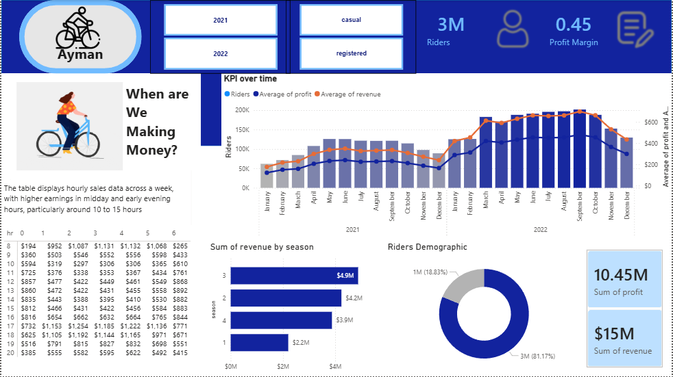
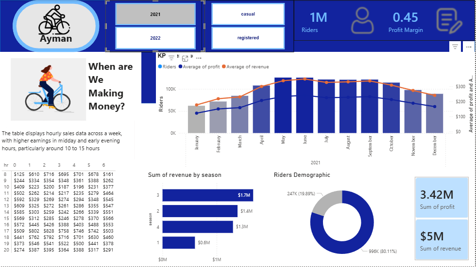

# 🚲 Toman Bike Share | End-to-End Data Analysis

## 📌 Project Overview
This project focuses on providing data-driven insights for **Toman Bike Share**. By integrating Excel data into a SQL database and developing an interactive Power BI dashboard, I analyzed key performance indicators (KPIs) to help the company make strategic decisions. The project specifically addresses a stakeholder request regarding a pricing strategy for the upcoming year.



## 🛠️ The Tech Stack
* **Excel:** Initial data source for ridership and cost metrics.
* **SQL (MS SQL Server):** Centralized data storage, ETL, and calculation of financial metrics.
* **Power BI:** Built an interactive dashboard for KPI tracking and trend analysis.
* **Business Analytics:** Applied price elasticity logic to recommend a 10-15% price increase.

## 🧠 Skills Demonstrated
* **Database Management:** Designing and querying relational databases using MS SQL Server.
* **ETL Process:** Extracting, transforming, and loading data from Excel into SQL and Power BI.
* **Data Modeling:** Creating a unified data schema using Unions and Joins.
* **DAX & Power Query:** Developing custom measures (Profit Margin, Ridership Growth) and performing data cleaning.
* **Business Intelligence:** Translating complex data into actionable insights for stakeholders.
* **Financial Analysis:** Calculating Revenue, COGS, and Profitability trends.

## 📝 The SQL Workflow
I used a **CTE (Common Table Expression)** to union the 2021 and 2022 datasets, ensuring a unified view for the final analysis.

```sql
WITH cte AS (
    SELECT * FROM bike_share_year_0
    UNION ALL
    SELECT * FROM bike_share_year_1
)
SELECT 
    dttm,
    season,
    a.yr,
    weekday,
    hr,
    rider_type,
    riders,
    price,
    COGS,
    riders * price AS revenue,
    riders * price - (riders * COGS) AS profit
FROM cte a
LEFT JOIN cost_table b ON a.yr = b.yr;
```
## 📊 Dashboard Highlights
* **Hourly Analysis:** Identified peak revenue windows between 7:00 AM – 9:00 AM and 4:00 PM – 7:00 PM.
* **Seasonality:** Peak demand occurs in Season 3, guiding inventory and maintenance schedules.
* **Profitability:** Calculated a stable profit margin of ~45% across both years.




## 💡 Recommendation
Based on the 64% increase in demand following a previous 25% price hike, I recommended a conservative 10-15% price increase for the next year. This strategy maximizes revenue while staying within the threshold of market tolerance.

---

## 📁 Repository Structure
* `Toman_Bike_share.pbix`: The final interactive Power Bi file.
* `/images/`: Screenshots of the final dashboard

## 📝 Acknowledgments
Special thanks to **Absent Data** for providing the dataset and the foundational tutorial for this project.

---

### Contact & Connect
* **LinkedIn:** [Ayman Djemoui](https://www.linkedin.com/in/ayman-djemoui-249286126/)
* **GitHub Portfolio:** [ayman4data](https://github.com/ayman4data)
